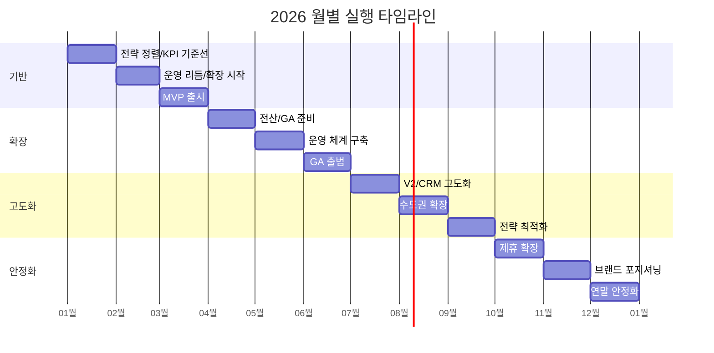
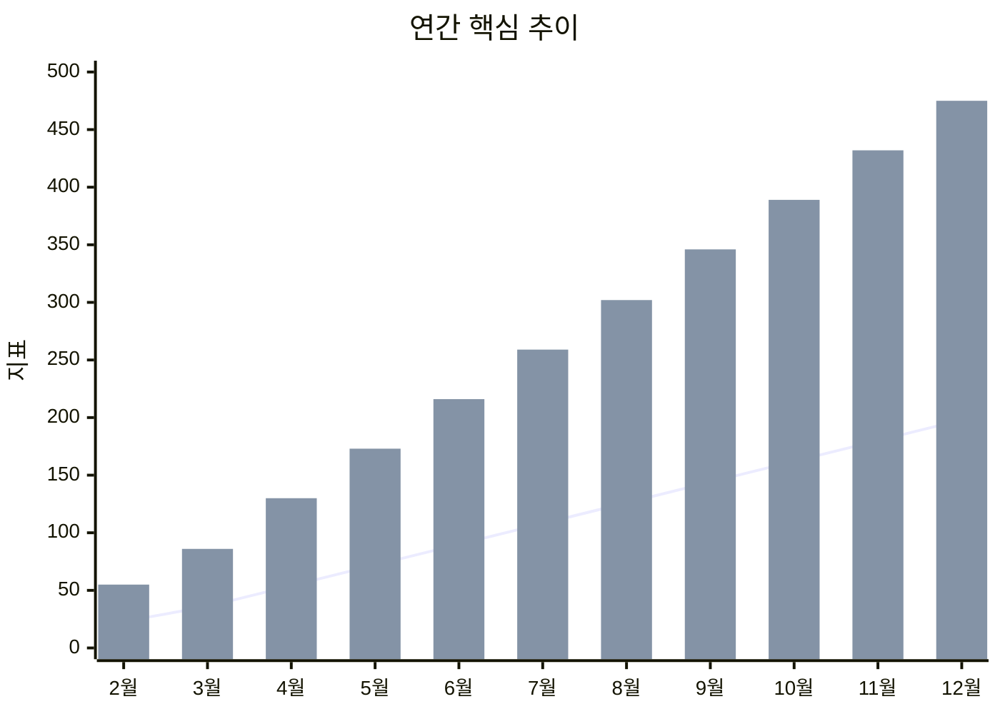

# 더바다 2026 운영전략 대시보드

> 기간: `2026-01 ~ 2026-12` | 단위: `KRW` | 관점: `경영진 상황판`

[연간 로드맵](./02_연간_로드맵.md) | [조직구성](./03_조직구성.md) | [채용계획](./04_채용계획.md) | [매출관리](./05_매출관리.md)

---

## 1) 상단 KPI 카드 영역

| 카드 | 현재 값 | 판단 |
|---|---:|---|
| 연말 인원 추정 | **193명** | 목표 180~200 충족 |
| 조정 채용 합계 | **185명** | 계획(220) 대비 보수 운영 |
| 연간 최종수익 합계 | **1,379,200,000** | 연간 흑자 |
| 손익 게이트 구간 | **5~7월 주의 / 8~12월 정상** | 8월부터 안정 구간 |

---

## 2) 상태 신호등/경보 영역

| 영역 | 상태 | 기준 | 코멘트 |
|---|---|---|---|
| 실행(로드맵) | 🟡 주의 | 지연 과제 발생 시 | 월초 우선순위 재정렬 필요 |
| 채용 | 🟢 정상 | 8~12월 100% 반영 | 인원 목표 구간 진입 |
| 매출 | 🟢 안정 | 손익률 5% 이상 | 하반기 확장 가능 |
| 리스크 | 🟡 주의 | 인력 온보딩/품질 | 월간 QA 점검 강화 |

---

## 3) 핵심 차트 영역

### 3-1. 월별 실행 타임라인 (로드맵·과제 우선)

### 3-2. 연간 핵심 추이 (인원/수익/비용)

> `line`: 누적 인원(명) / `bar`: 수익1150(백만원 환산)

---

## 4) 의사결정용 요약표

| 의사결정 항목 | 이번달 확인 포인트 | 임계값 | 조치 |
|---|---|---|---|
| 채용 속도 | 계획 vs 조정 괴리 | -20% 이하 | 우선 직무만 채용 |
| 손익률 | 월 손익률 | 5% 미만 | 마케팅/채용 속도 조절 |
| 실행 완수율 | 월 과제 완료율 | 70% 미만 | 과제 재배치 |
| 품질 이슈 | CS/청구 지연 건수 | 전월 대비 +20% | 원인팀 긴급점검 |

---

## 5) 이번달 실행 우선순위 (Top 5)

| 우선순위 | 과제 | 오너 | 상태 |
|---:|---|---|---|
| 1 | 월간 KPI 스냅샷 확정 | 대표/CSO | 진행중 |
| 2 | 지연 과제 원인 제거 | 각 팀 리드 | 계획 |
| 3 | 채용 게이트 재평가 | 대표/CSO | 계획 |
| 4 | 손익 경보 리뷰 | 재무/운영 | 계획 |
| 5 | 다음달 Top3 의사결정 확정 | 경영진 | 계획 |

---

## 6) 리스크 및 즉시 액션

| 리스크 | 영향 | 즉시 액션 |
|---|---|---|
| 온보딩 지연 | 생산성 저하 | 인사팀 주간 온보딩 리포트 |
| 초기품질 저하 | CS/청구 증가 | 콜/청구 QA 샘플링 확대 |
| 손익률 하락 | 채용 축소 필요 | 비용 항목별 절감 시나리오 즉시 실행 |

---

## 7) 하위 문서/DB 네비게이션

- 영역 문서
  - [연간 로드맵](./02_연간_로드맵.md)
  - [조직구성](./03_조직구성.md)
  - [채용계획](./04_채용계획.md)
  - [매출관리](./05_매출관리.md)
- 팀 상세
  - [영업팀](./06_영업팀_상세.md) | [콜팀](./07_콜팀_상세.md) | [청구팀](./08_청구팀_상세.md)
  - [기획개발팀](./09_기획개발팀_상세.md) | [인사팀](./10_인사팀_상세.md) | [마케팅팀](./11_마케팅팀_상세.md) | [CS팀](./12_CS팀_상세.md) | [법률팀](./13_법률팀_상세.md)

---

## 이번달 의사결정 체크리스트

- [ ] 로드맵 지연 과제 원인/오너 확정
- [ ] 채용 게이트 상태 재평가 (주의/정상)
- [ ] 손익률 5% 기준 충족 여부 확인
- [ ] 품질 리스크(콜/청구/CS) 에스컬레이션
- [ ] 다음달 우선순위 Top3 확정
