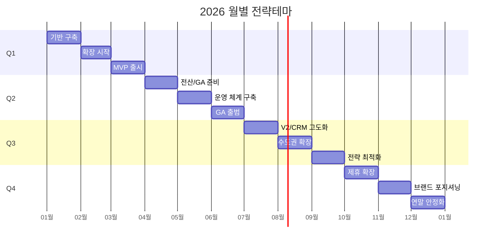

# 2026 연간 로드맵 대시보드

[마스터 복귀](./01_마스터_대시보드.md) | [다음: 조직구성](./03_조직구성.md)

---

## 1) 상단 KPI 카드 영역

| KPI | 값 |
|---|---:|
| 로드맵 기간 | 12개월 |
| 월간 핵심 이벤트 | 12개 |
| 게이트 주의 구간 | 5~7월 |
| 게이트 정상 구간 | 8~12월 |

---

## 2) 상태 신호등/경보 영역

| 월 | 게이트 | 마일스톤 상태 |
|---|---|---|
| 1~4월 | ⚪ 게이트 전 | 계획/기반 구축 |
| 5~7월 | 🟡 주의 | 확장 속도 조절 |
| 8~12월 | 🟢 정상 | 확장 가속 |

---

## 3) 핵심 차트 영역

### 3-1. 월별 실행 간트

---

## 4) 의사결정용 요약표

| 월 | 전략테마 | 핵심실행 | 게이트 | 마일스톤 |
|---|---|---|---|---|
| 1월 | 기반 구축 | KPI 기준선 확정 | 게이트 전 | 계획 |
| 2월 | 확장 시작 | 운영 리듬 세팅 | 게이트 전 | 진행중 |
| 3월 | MVP 출시 | 청구자동화+앱 MVP | 게이트 전 | 진행중 |
| 4월 | 전산/GA 준비 | 전산 구축/GA 준비 | 게이트 전 | 진행중 |
| 5월 | 운영 체계 구축 | 서류/법률 체계 구축 | 주의 | 진행중 |
| 6월 | GA 출범 | 준법감시체계 가동 | 주의 | 진행중 |
| 7월 | V2·CRM 고도화 | CRM/브랜딩 | 주의 | 진행중 |
| 8월 | 수도권 확장 | CS체계 확장 | 정상 | 진행중 |
| 9월 | 전략 최적화 | 운영 효율화 | 정상 | 진행중 |
| 10월 | 제휴 확장 | 제휴 채널 확보 | 정상 | 진행중 |
| 11월 | 브랜드 포지셔닝 | 시장 메시지 통일 | 정상 | 진행중 |
| 12월 | 연말 안정화 | 차년도 준비 | 정상 | 계획 |

---

## 5) 이번달 실행 우선순위 (Top 5)

| 순위 | 과제 | 연계 문서 |
|---:|---|---|
| 1 | 당월 지연과제 제거 | [마스터](./01_마스터_대시보드.md) |
| 2 | 게이트 상태 재판정 | [채용계획](./04_채용계획.md) |
| 3 | 수익성 관점 일정 조정 | [매출관리](./05_매출관리.md) |
| 4 | 팀간 의존성 정리 | [조직구성](./03_조직구성.md) |
| 5 | 경영회의 보고서 확정 | [마스터](./01_마스터_대시보드.md) |

---

## 6) 리스크 및 즉시 액션

| 리스크 | 징후 | 즉시 액션 |
|---|---|---|
| 월간 과제 밀림 | 완료율 70% 미만 | 중요도 하위 과제 익월 이관 |
| 교차팀 병목 | 콜-영업-청구 대기 | 주간 공통 스탠드업 고정 |
| 손익 미달 일정 강행 | 손익률 하락 | 고비용 과제 일정 재배치 |

---

## 7) 하위 문서/DB 네비게이션

- [마스터 대시보드](./01_마스터_대시보드.md)
- [조직구성](./03_조직구성.md)
- [채용계획](./04_채용계획.md)
- [매출관리](./05_매출관리.md)
