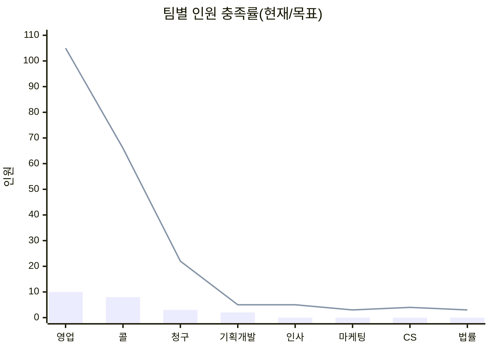

# 2026 조직구성 대시보드 (8개팀)

[이전: 연간 로드맵](./02_연간_로드맵.md) | [마스터 복귀](./01_마스터_대시보드.md) | [다음: 채용계획](./04_채용계획.md)

---

## 1) 상단 KPI 카드 영역

| KPI | 값 |
|---|---:|
| 수익조직 팀 수 | 3 |
| 지원조직 팀 수 | 5 |
| 총 목표 인원(8개팀) | 213명 |
| 현재 인원(8개팀) | 23명 |

---

## 2) 상태 신호등/경보 영역

| 조직군 | 상태 | 코멘트 |
|---|---|---|
| 수익조직(영업/콜/청구) | 🟢 정상 | 채용/운영 루틴 정착 |
| 지원조직(IT/HR/MKT/CS/법률) | 🟡 주의 | 하반기 확충/온보딩 필요 |

---

## 3) 핵심 차트 영역

---

## 4) 의사결정용 요약표

### 4-1. 수익조직

| 팀 | 현재 | 목표 | 충족률 | 상태 |
|---|---:|---:|---:|---|
| 영업팀 | 10 | 105 | 9.5% | 🟡 |
| 콜팀 | 8 | 66 | 12.1% | 🟡 |
| 청구팀 | 3 | 22 | 13.6% | 🟡 |

### 4-2. 지원조직

| 팀 | 현재 | 목표 | 충족률 | 상태 |
|---|---:|---:|---:|---|
| 기획개발팀 | 2 | 5 | 40.0% | 🟢 |
| 인사팀 | 0 | 5 | 0% | 🔴 |
| 마케팅팀 | 0 | 3 | 0% | 🔴 |
| CS팀 | 0 | 4 | 0% | 🔴 |
| 법률팀 | 0 | 3 | 0% | 🔴 |

---

## 5) 이번달 실행 우선순위 (Top 5)

| 순위 | 과제 |
|---:|---|
| 1 | 인사팀 채용 파이프라인 즉시 가동 |
| 2 | 콜/청구 품질관리자 배치 확정 |
| 3 | IT-운영 요구사항 백로그 재정렬 |
| 4 | 법률/준법감시 운영 체크리스트 확정 |
| 5 | 팀별 KPI 오너 명확화 |

---

## 6) 리스크 및 즉시 액션

| 리스크 | 영향 | 즉시 액션 |
|---|---|---|
| 지원조직 미구축 | 확장 지연 | 인사/마케팅/CS/법률 우선 채용 |
| 관리자 부족 | 품질 편차 | 영업/콜 관리자 채용 우선 배정 |
| 팀간 정보 단절 | 의사결정 지연 | 공통 주간 운영회의 고정 |

---

## 7) 하위 문서/DB 네비게이션

- 수익조직 상세
  - [영업팀](./06_영업팀_상세.md)
  - [콜팀](./07_콜팀_상세.md)
  - [청구팀](./08_청구팀_상세.md)
- 지원조직 상세
  - [기획개발팀](./09_기획개발팀_상세.md)
  - [인사팀](./10_인사팀_상세.md)
  - [마케팅팀](./11_마케팅팀_상세.md)
  - [CS팀](./12_CS팀_상세.md)
  - [법률팀](./13_법률팀_상세.md)
