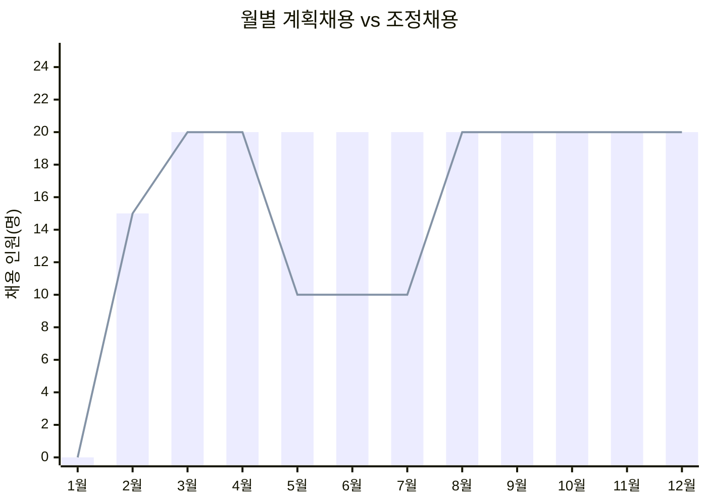
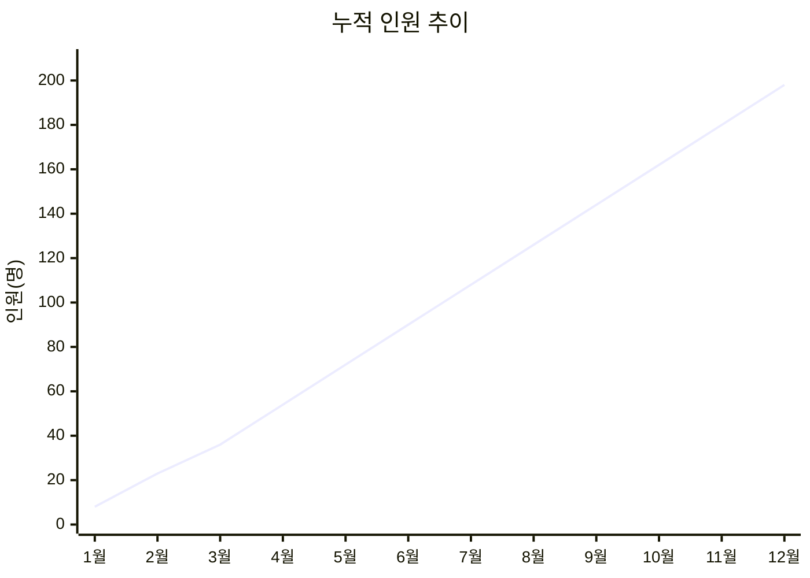

# 2026 채용계획 대시보드

[이전: 조직구성](./03_조직구성.md) | [마스터 복귀](./01_마스터_대시보드.md) | [다음: 매출관리](./05_매출관리.md)

---

## 1) 상단 KPI 카드 영역

| KPI | 값 |
|---|---:|
| 계획 채용 합계 | 220명 |
| 조정 채용 합계 | **185명** |
| 연말 인원 추정 | **193명** |
| 목표 범위 충족 | 180~200 ✅ |

---

## 2) 상태 신호등/경보 영역

| 구간 | 게이트 | 채용 반영률 |
|---|---|---:|
| 1~4월 | ⚪ 게이트 전 | 100% |
| 5~7월 | 🟡 주의 | 50% |
| 8~12월 | 🟢 정상 | 100% |

---

## 3) 핵심 차트 영역

### 3-1. 계획채용 vs 조정채용

### 3-2. 누적 인원 추이

---

## 4) 의사결정용 요약표

| 월 | 계획채용 | 조정채용 | 누적 인원 | 게이트 |
|---:|---:|---:|---:|---|
| 2월 | 15 | 15 | 23 | 게이트 전 |
| 3월 | 20 | 20 | 36 | 게이트 전 |
| 4월 | 20 | 20 | 54 | 게이트 전 |
| 5월 | 20 | 10 | 72 | 주의 |
| 6월 | 20 | 10 | 90 | 주의 |
| 7월 | 20 | 10 | 108 | 주의 |
| 8월 | 20 | 20 | 126 | 정상 |
| 9월 | 20 | 20 | 144 | 정상 |
| 10월 | 20 | 20 | 162 | 정상 |
| 11월 | 20 | 20 | 180 | 정상 |
| 12월 | 20 | 20 | 198 | 정상 |

---

## 5) 이번달 실행 우선순위 (Top 5)

| 순위 | 과제 |
|---:|---|
| 1 | 게이트 상태 기반 다음달 채용 TO 확정 |
| 2 | 관리자 포지션 우선 충원 |
| 3 | 온보딩 속도/이탈률 동시 점검 |
| 4 | 채용비용 대비 생산성 추적 |
| 5 | 지원조직 채용(인사/마케팅/CS/법률) 일정 고정 |

---

## 6) 리스크 및 즉시 액션

| 리스크 | 기준 | 즉시 액션 |
|---|---|---|
| 과채용 | 손익률 5% 미만 | 다음달 TO 50% 축소 |
| 핵심직무 미충원 | 관리자 공석 | 관리자 직무 우선 채용 |
| 온보딩 병목 | 초기 이탈 증가 | 인사팀 교육 루틴 강화 |

---

## 7) 하위 문서/DB 네비게이션

- [마스터 대시보드](./01_마스터_대시보드.md)
- [연간 로드맵](./02_연간_로드맵.md)
- [조직구성](./03_조직구성.md)
- [매출관리](./05_매출관리.md)
