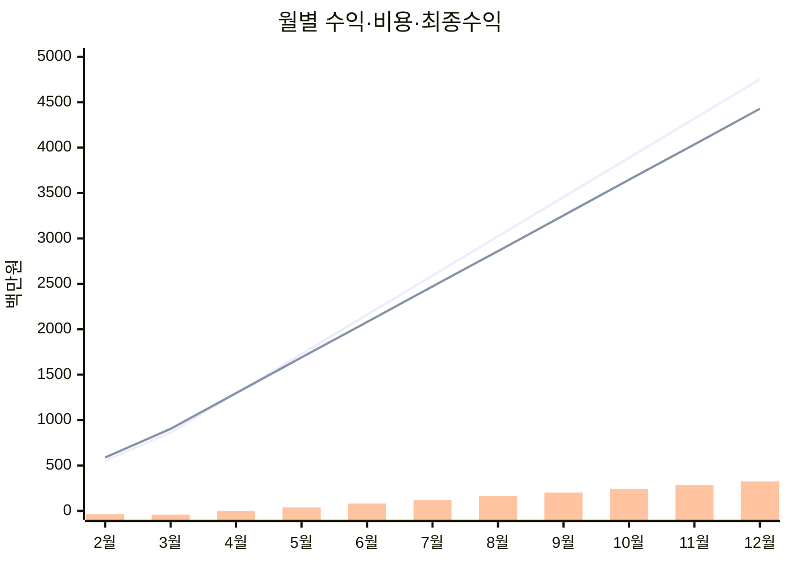

# 2026 매출관리 대시보드

[이전: 채용계획](./04_채용계획.md) | [마스터 복귀](./01_마스터_대시보드.md)

---

## 1) 상단 KPI 카드 영역

| KPI | 값 |
|---|---:|
| 수익1150 합계 | **28,632,000,000** |
| 총비용 합계 | **27,252,800,000** |
| 최종수익 합계 | **1,379,200,000** |
| BEP 전환 시점 | **2026-05** |

---

## 2) 상태 신호등/경보 영역

| 구간 | 손익 상태 | 경보 |
|---|---|---|
| 2~4월 | 적자 | 🔴 위험 |
| 5~7월 | 흑자 전환 | 🟡 주의 |
| 8~12월 | 안정 흑자 | 🟢 안정 |

---

## 3) 핵심 차트 영역

### 3-1. 수익1150 / 총비용 / 최종수익 추이

### 3-2. 경보 전환 흐름

---

## 4) 의사결정용 요약표

| 월 | 수익1150 | 총비용 | 최종수익 | 손익률 | 경보 |
|---:|---:|---:|---:|---:|---|
| 2월 | 552,000,000 | 587,800,000 | -35,800,000 | -6.5% | 위험 |
| 3월 | 864,000,000 | 903,600,000 | -39,600,000 | -4.6% | 위험 |
| 4월 | 1,296,000,000 | 1,297,400,000 | -1,400,000 | -0.1% | 위험 |
| 5월 | 1,728,000,000 | 1,690,200,000 | 37,800,000 | 2.2% | 주의 |
| 6월 | 2,160,000,000 | 2,079,000,000 | 81,000,000 | 3.8% | 주의 |
| 7월 | 2,592,000,000 | 2,471,800,000 | 120,200,000 | 4.6% | 주의 |
| 8월 | 3,024,000,000 | 2,860,600,000 | 163,400,000 | 5.4% | 안정 |
| 9월 | 3,456,000,000 | 3,253,400,000 | 202,600,000 | 5.9% | 안정 |
| 10월 | 3,888,000,000 | 3,646,200,000 | 241,800,000 | 6.2% | 안정 |
| 11월 | 4,320,000,000 | 4,035,000,000 | 285,000,000 | 6.6% | 안정 |
| 12월 | 4,752,000,000 | 4,427,800,000 | 324,200,000 | 6.8% | 안정 |

---

## 5) 이번달 실행 우선순위 (Top 5)

| 순위 | 과제 |
|---:|---|
| 1 | 손익률 5% 방어선 유지 |
| 2 | 고정비/변동비 항목별 절감 점검 |
| 3 | 채용 속도와 손익 연동 재확인 |
| 4 | 경보가 위험으로 내려갈 조짐 사전 탐지 |
| 5 | 월말 확정 손익 기반 다음달 계획 보정 |

---

## 6) 리스크 및 즉시 액션

| 리스크 | 영향 | 즉시 액션 |
|---|---|---|
| 비용 급증 | 손익률 하락 | 마케팅/채용 집행률 조정 |
| 매출 증가 둔화 | 확장지연 | 영업/콜 퍼널 전환율 점검 |
| 품질 이슈로 보상비 증가 | 수익성 악화 | CS/청구 선제 QA 강화 |

---

## 7) 하위 문서/DB 네비게이션

- [마스터 대시보드](./01_마스터_대시보드.md)
- [연간 로드맵](./02_연간_로드맵.md)
- [조직구성](./03_조직구성.md)
- [채용계획](./04_채용계획.md)
